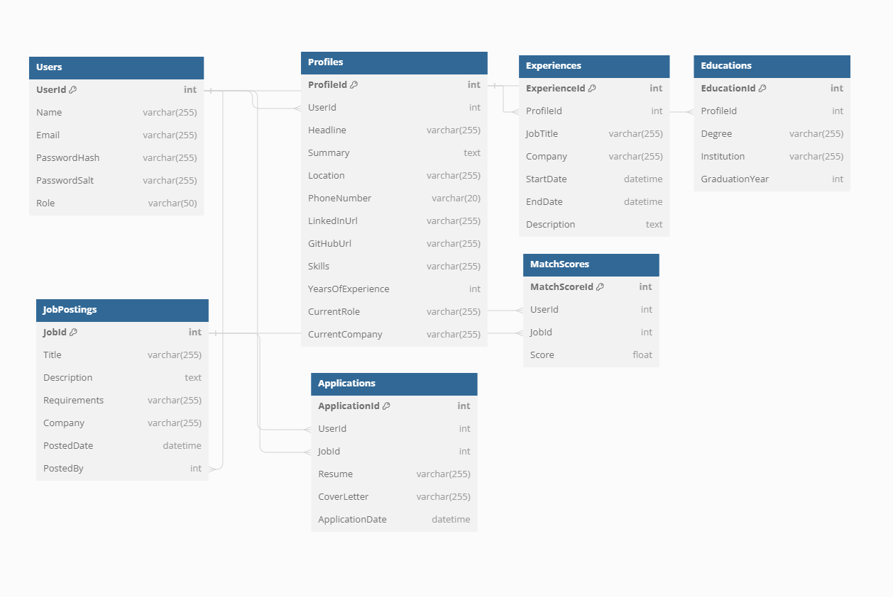
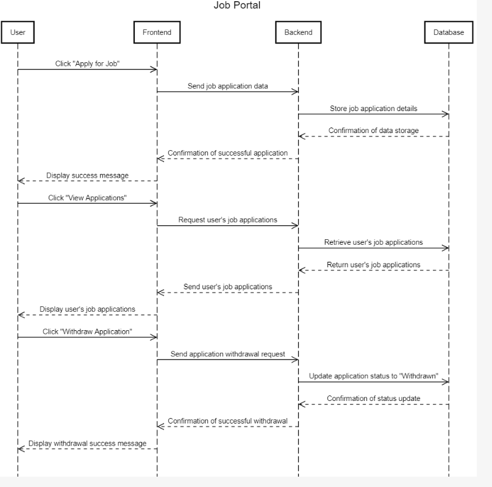

# Job Portal MVP

## Overview
This project is a minimum viable product (MVP) for a job portal built using React for the frontend and .NET for the backend, with Microsoft SQL Server as the database. The goal is to provide a platform where users can search for job postings, apply for jobs, and manage their profiles. This MVP focuses on essential features that can be developed in one week.

## Features

### Frontend
1. **User Registration and Login**
   - Simple registration form for users to sign up.
   - Login system with email and password authentication.

2. **Job Search**
   - Search bar for users to search jobs based on keywords, location, and job type.
   - Display a list of job postings based on search criteria.

3. **Job Details Page**
   - Detailed information page for each job posting.
   - Includes job description, requirements, and company information.

4. **Apply for a Job**
   - Feature allowing users to apply for jobs directly from the job details page.
   - Users can upload their resume and cover letter.

5. **Skill and Experience Matching**
   - Users can create detailed profiles that highlight their skills and experiences.
   - When viewing job postings, users can see how their qualifications match the job requirements.
   - Employers can view candidates' profiles alongside job applications, making it easier to identify suitable candidates.

### Backend
1. **User Management**
   - Database schema to store user information (name, email, password, etc.).
   - User registration and login functionality using ASP.NET Identity.

2. **Job Posting Management**
   - Database schema to store job posting information (job title, description, requirements, company, etc.).
   - CRUD (Create, Read, Update, Delete) operations for job postings.

3. **Job Application Management**
   - Database schema to store job application information (user ID, job ID, resume, cover letter, etc.).
   - Feature to save job applications submitted by users.

4. **Search and Filtering**
   - Search functionality for users to find jobs based on keywords, location, and job type.
   - Filtering options to narrow down search results.

## Additional Features ( If time permits)
1. **Messaging Between Job Posters and Job Seekers**
   - Job posters can send messages to job seekers who have applied for their job postings.
   - Job seekers can reply to messages from job posters.
   - Messages are stored in the database for record-keeping.

2. **Job Alerts via Email**
   - Users can set up alerts to receive notifications about new job postings that match their criteria via SMS or email.

3. **User-Generated Company Reviews**
   - Users can leave reviews and ratings for companies they have interviewed with or worked for.

4. **Bookmarking Jobs**
   - Users can save job listings they are interested in for easy access later.

## Technology Stack
- **Frontend:** React
- **Backend:** ASP.NET Web API
- **Database:** Microsoft SQL Server

## Class diagram

## Sequence diagram

